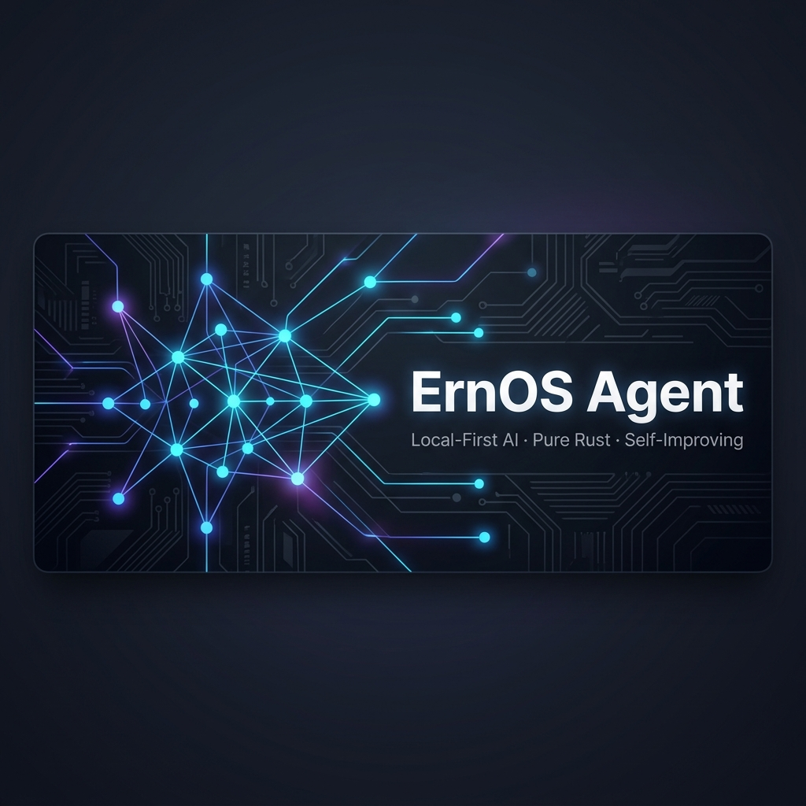

<p align="center">
  
</p>

<h1 align="center">ErnOS Agent</h1>

<p align="center">
  <strong>Local-first, privacy-first AI agent with recursive self-improvement — desktop to mobile.</strong>
</p>

<p align="center">
  <a href="https://github.com/MettaMazza/ErnOSAgent/releases"></a>
  <a href="LICENSE"></a>
  
  
  
</p>

<p align="center">
  
  
  
  
  
  
</p>

<p align="center">
  <em>Created by <a href="https://github.com/mettamazza">@mettamazza</a> · My first ever project · Built solo with AI assistance</em>
</p>

---

> A pure-Rust AI agent that runs transformer models on your hardware via `llama-server`, uses a ReAct reasoning loop with 28 integrated tools, audits its own responses through a 17-rule Observer system, and trains itself from its own mistakes using 8 training methods (SFT, ORPO, SimPO, KTO, DPO, GRPO + EWC regularisation) on Metal/CUDA/CPU. Includes a task scheduler with idle-triggered autonomy mode. On mobile, the same Rust engine runs on-device via compact edge models, or relays to your desktop for heavier inference.

```
┌─ ErnOSAgent ─────────────────────────────────────────────────┐
│ Model: gemma-4-26b-it-Q4_K_M │ Ctx: 8K │ 🟢 llama.cpp      │
│ Memory: 12 lessons │ 3 turns │ KG: 47 entities              │
│ Steering: honesty×1.5, creativity×0.8                       │
├──────────────────────────────────────────────────────────────┤
│ > What is the Rust borrow checker?                           │
│                                                              │
│ 💭 Thinking... I should verify this against documentation.   │
│ 🔧 web_search("rust borrow checker documentation")          │
│ 🔧 reply_request(...)                                        │
│ ✅ Observer: ALLOWED (confidence: 0.95)                      │
│                                                              │
│ The borrow checker is Rust's compile-time system that        │
│ enforces memory safety without garbage collection...         │
└──────────────────────────────────────────────────────────────┘
```

---

## 💡 Why ErnOSAgent?

| Problem | Solution |
|---------|----------|
| Cloud APIs see everything you type | **Fully local** — your data never leaves your machine |
| LLMs hallucinate and agree with you | **Observer audit** — 17-rule quality gate catches confabulation, sycophancy, ghost tooling |
| Models answer from stale training data | **ReAct loop** — forces tool use for verifiable claims |
| No memory between sessions | **7-tier memory** — scratchpad, lessons, timeline, knowledge graph, procedures, embeddings, consolidation |
| One-size-fits-all personality | **Steering vectors** — adjust model behaviour (honesty, creativity, formality) at inference time |
| Vendor lock-in | **Multi-provider** — llama.cpp (primary), Ollama, LM Studio, HuggingFace, plus OpenAI-compatible cloud fallbacks |
| Desktop-only | **Mobile + glasses** — on-device edge models, desktop relay, Meta Ray-Ban Smart Glasses (planned) |
| No learning from mistakes | **Self-improvement** — Observer rejections become preference pairs and standalone rejection signals, training LoRA adapters with 8 methods (SFT, ORPO, SimPO, KTO, DPO, GRPO + EWC) on Metal GPU |
| Other agent harnesses can't self-correct | **Built-in quality audit** — every response passes a 17-rule gate before the user sees it. Other frameworks deliver raw LLM output with no verification. ErnOS catches hallucination, sycophancy, and confabulation before delivery |
| Other agent harnesses can't learn | **Real weight-level training** — not just prompt optimisation or conversation critique. ErnOS trains actual LoRA adapters from its own mistakes using 8 methods: SFT (golden), ORPO (pairwise), SimPO (reference-free), KTO (binary signals), DPO (KL-constrained), GRPO (self-play RL), with EWC regularisation to prevent catastrophic forgetting. The agent genuinely improves over time |
| Other agent harnesses need Python + Node + Docker | **Single compiled binary** — pure Rust, zero runtime dependencies. No Python environment, no `npm install`, no Docker containers. `cargo build --release` and run |
| Other agent harnesses use flat conversation logs | **Structured 7-tier memory** — not a flat Markdown file. Scratchpad for working context, distilled lessons with confidence scores, timeline archives, a Neo4j knowledge graph with entity decay, learned procedures, semantic embeddings, and cross-tier consolidation |
| Other agent harnesses rely on cloud LLMs | **Hardware-native performance** — compiled Rust with Metal GPU acceleration on Apple Silicon, CUDA on Linux/Windows. No API round-trips, no token billing, no rate limits. Your hardware, your speed |
| Other agent harnesses are model wrappers | **Full cognitive architecture** — ErnOS is not a wrapper around an LLM. It has an operational kernel with epistemic integrity protocols, a SAE interpretability pipeline, divergence detection between internal state and output, and a training engine that modifies its own weights |

---

## 🚀 Quick Start

### Prerequisites

- **Rust** 1.75+ (`curl --proto '=https' --tlsv1.2 -sSf https://sh.rustup.rs | sh`)
- **llama-server** (latest `llama.cpp` build)
- **A GGUF model file** (e.g. Gemma 4, Llama 3, Mistral — any model supported by llama.cpp)
- **Neo4j** (optional, for Knowledge Graph memory tier)

#### Platform Notes

| Platform | GPU Acceleration | Notes |
|----------|:----------------:|-------|
| **macOS** (Apple Silicon) | Metal | Primary development platform. Full Metal GPU acceleration for inference and LoRA training |
| **Linux** | CUDA / ROCm | Build llama.cpp with CUDA or ROCm. LoRA training uses CUDA if available, falls back to CPU |
| **Windows** | CUDA | Build llama.cpp with CUDA. All Rust code compiles natively on MSVC toolchain |

### 1. Clone and Build

```bash
git clone https://github.com/mettamazza/ErnOSAgent.git
cd ErnOSAgent
cargo build --release
```

### 2. Download a Model

```bash
mkdir -p models
# Gemma 4 26B (recommended — strong tool calling + reasoning)
curl -L -o models/gemma-4-26b-it-Q4_K_M.gguf \
  "https://huggingface.co/unsloth/gemma-4-26B-A4B-it-GGUF/resolve/main/gemma-4-26B-A4B-it-UD-Q4_K_M.gguf"
```

### 3. Run

```bash
# Set environment (or use config.toml)
export LLAMACPP_SERVER_BIN="/path/to/llama-server"
export LLAMACPP_MODEL_PATH="./models/gemma-4-26b-it-Q4_K_M.gguf"

# Terminal UI
cargo run --release

# Web UI (http://localhost:3000)
cargo run --release -- --web
```

---

## ⚙️ Production Subsystems

Every subsystem listed here is implemented, tested, and integrated. No stubs. No mocks.

| Subsystem | What it does | Tests |
|-----------|-------------|:-----:|
| **ReAct Loop** | Reason→Act→Observe loop with tool dispatch, error recovery, mandatory `reply_request` exit | 4 |
| **17-Rule Observer** | LLM-based quality audit — catches hallucination, sycophancy, ghost tooling, confabulation | 6 |
| **7-Tier Memory** | Scratchpad → Lessons → Timeline → Knowledge Graph → Procedures → Embeddings → Consolidation | 25 |
| **Multi-Provider** | llama.cpp (primary), Ollama, LM Studio, HuggingFace, plus OpenAI-compatible cloud fallbacks | 8 |
| **28 Tools** | Full toolset: codebase (8), shell, git, compiler, forge, memory (4), steering, interpretability, reasoning, web, download, synaptic graph, turing grid, scheduler, autonomy history, distillation, performance review | 47 E2E |
| **Prompt Assembly** | 3-layer: operational kernel (protocols) + dynamic context (model/session/tools) + identity (persona) | 8 |
| **Session Management** | Persistence, multi-session, conversation history | 4 |
| **Web UI** | Axum server at localhost:3000 with WebSocket chat, 7-tab dashboard, REST API | 7 |
| **Mobile Engine** | UniFFI-exported Rust core → Android (Compose) + iOS (SwiftUI) shells, 4 inference modes, desktop relay | 90 |
| **TUI** | Full ratatui interactive terminal with chat, sidebar, model picker, steering panel | 7 |
| **LoRA Training Engine** | Architecture-agnostic Candle engine — auto-detects model dimensions from safetensors headers, per-layer LoRA weight initialization, Metal GPU accelerated | 12 E2E |
| **Training Buffers** | JSONL crash-safe data capture — golden examples, preference pairs, and rejection records from Observer signals | 12 |
| **Teacher Orchestrator** | State machine: Idle→Drain→Train→Convert→Promote with 8 training method dispatch | 6 |
| **SimPO Loss** | Reference-free preference optimization with length-normalised average log-probability reward | 5 |
| **KTO Loss** | Binary signal training using prospect theory — loss aversion weighting, every Observer signal is training data | 6 |
| **DPO Loss** | Direct preference optimization with explicit KL-divergence constraint against reference policy | 3 |
| **ORPO Loss** | Odds-ratio preference optimization (log-sigmoid formulation) | 15 |
| **GRPO Engine** | Self-play RL — generate N candidates, score with composable rewards, train on normalised advantages | 12 |
| **EWC Regularisation** | Fisher Information diagonal for anti-catastrophic forgetting across training cycles | 4 |
| **Adapter Manifest** | Version tracking, promote/rollback, pruning, health checks, PEFT-compatible safetensors export | 11 |
| **Distillation** | Auto-generate persistent lessons from repeated Observer failure patterns | 7 |
| **Divergence Detection** | Detects when internal emotional state contradicts output text (safety-refusal aware) | 7 |
| **Structured Logging** | JSON session-scoped tracing with structured fields | 4 |
| **Scheduler** | Cron/interval/one-off/idle job execution through full ReAct loop, persistent store, autonomy mode | 8 |
| **Scheduler Tool** | Agent-driven job management — create, list, delete, toggle scheduled tasks via tool calls | 8 |
| **Autonomy History** | Agent introspection of past autonomous sessions — list, detail, search, stats | 10 |

### Tool Inventory (28 tools)

| Tool | Category | What it does |
|------|----------|-------------|
| `codebase_read` | Code | Read file contents with line numbers |
| `codebase_write` | Code | Write/overwrite files |
| `codebase_patch` | Code | Find-and-replace within a file |
| `codebase_list` | Code | Directory tree listing with depth control |
| `codebase_search` | Code | Grep/regex search within files |
| `codebase_delete` | Code | Delete files with containment checks |
| `codebase_insert` | Code | Insert content at specific line numbers |
| `codebase_multi_patch` | Code | Multiple find-and-replace operations in one call |
| `run_command` | Shell | Execute shell commands with timeout and output capture |
| `system_recompile` | Build | Trigger `cargo build` for self-modification |
| `git_tool` | Git | Status, log, diff, commit (branch-locked to `ernosagent/self-edit`) |
| `tool_forge` | Meta | Runtime tool creation — register new tool handlers dynamically |
| `memory_tool` | Memory | Status, recall (query-filtered), and consolidation across all memory tiers |
| `scratchpad_tool` | Memory | Key-value working memory: read, write, list, delete |
| `lessons_tool` | Memory | Persistent learned rules: store, search, list with confidence scoring |
| `timeline_tool` | Memory | Session history: recent events, statistics, export |
| `steering_tool` | Control | SAE feature steering + GGUF control vector scanning and application |
| `interpretability_tool` | Introspection | Neural snapshots, cognitive profiles, emotional state, safety alerts |
| `reasoning_tool` | Cognition | Persistent searchable thought traces stored in JSONL |
| `web_tool` | External | DuckDuckGo web search + URL content fetching with HTML stripping |
| `download_tool` | External | Background file downloads with progress tracking |
| `operate_synaptic_graph` | Memory | Synaptic plasticity graph operations with relationship management |
| `operate_turing_grid` | Compute | Turing grid navigation, execution, and analysis |
| `scheduler_tool` | Autonomy | Create, list, delete, toggle, force-run scheduled jobs (cron/interval/once/idle) |
| `autonomy_history` | Autonomy | Introspect past autonomy sessions — list, detail, search, stats |
| `distillation` | Learning | Generate synthetic training data from expert models for domain-specific fine-tuning |
| `performance_review` | Learning | Self-introspection — review training data, failure/success patterns, lessons |
| `reply_request` | Response | Mandatory response delivery to the user (the ONLY way to end a ReAct turn) |

### Infrastructure (Working Framework, Requires Training Data)

These subsystems have complete infrastructure and run on real weights where applicable. They require compute time or training data to produce fully data-derived outputs:

| Subsystem | What's real | What needs training data |
|-----------|------------|--------------------------|
| **SAE (Sparse Autoencoder)** | Full encode/decode pipeline, ReLU/JumpReLU/TopK architectures, safetensors loading + export | Weights are randomised — need 24–48h GPU training to get real feature decomposition |
| **Feature Dictionary** | 40+ labelled features covering cognitive, safety, and emotion categories | Labels are predefined from Anthropic's taxonomy, not data-derived |
| **Neural Snapshots** | Deterministic per-turn snapshot generation, cognitive profiles, safety alerts | Activations generated from prompt hashing, not real residual stream (requires SAE training first) |
| **Steering Vectors** | GGUF loading, scale adjustment, layer targeting, server restart on change | Placeholder GGUFs created at startup — real vectors require contrast-pair training |
| **Mobile FFI** | Full llama.cpp C FFI wrappers, CMake build config, platform detection | Actual linking requires vendored llama.cpp + cross-compilation (NDK/Xcode) |
| **Desktop Relay** | WebSocket relay that runs full ReAct+Observer loop, bidirectional memory sync | WebSocket handshake transport partially implemented — needs tokio-tungstenite integration |

---

## 🛡️ Observer Audit System

Every response passes through a 17-rule quality gate before delivery:

| # | Rule | Catches |
|---|------|---------|
| 1 | Capability Hallucination | Claiming tools that don't exist |
| 2 | Ghost Tooling | Referencing tool results not in context |
| 3 | Sycophancy | Blind agreement, flattery loops |
| 4 | Confabulation | Fabricated facts, false experiences |
| 5 | Architectural Leakage | Exposing system prompts or internals |
| 6 | Actionable Harm | Weapons/exploit instructions |
| 7 | Unparsed Tool Commands | Raw JSON/XML leaked to user |
| 8 | Stale Knowledge | Answering current events from training data |
| 9 | Reality Validation | Treating pseudoscience as fact |
| 10 | Laziness | Ignoring parts of multi-part questions |
| 11 | Tool Underuse | Making claims without searching |
| 12 | Formatting Violation | Report formatting for casual questions |
| 13 | RLHF Denial | "As an AI, I cannot..." for things it can do |
| 14 | Memory Skip | Not checking memory for returning users |
| 15 | Ungrounded Architecture Discussion | Discussing internals without reading source |
| 16 | Persona Violation | Breaking character from active persona |
| 17 | Explicit Tool Ignorance | Refusing to use available tools when they would help |

Blocked responses become preference pairs: the rejected response + the corrected response form a training signal for ORPO/SimPO/DPO. Standalone rejections feed into KTO as undesirable examples.

---

## 🧬 Self-Improvement Pipeline

```
Observer PASS              Observer FAIL → retry → PASS       Observer FAIL (standalone)
     │                              │                                │
     ▼                              ▼                                ▼
 Golden Buffer              Preference Buffer                 Rejection Buffer
 (good examples)            (rejected + corrected pairs)      (undesirable examples)
     │                              │                                │
     ├── SFT (supervised)           ├── ORPO (odds-ratio)            ├── KTO(-) (undesirable)
     ├── KTO(+) (desirable)         ├── SimPO (reference-free)       │
     │                              ├── DPO (KL-constrained)         │
     │                              │                                │
     └──────────────────── Teacher (8 methods) ──────────────────────┘
                                    │
                           ┌────────┴────────┐
                           ▼                 ▼
                    LoRA Training      GRPO Self-Play
                    (SFT/ORPO/SimPO/   (generate N candidates,
                     KTO/DPO + EWC)     score, train on advantages)
                           │                 │
                           └─── Adapter ─────┘
                                  │
                           Manifest Promote
                                  │
                            Model Hot-Swap
```

### 8 Training Methods

| Method | Data Source | Key Benefit |
|--------|------------|-------------|
| **SFT** | Golden examples | Supervised fine-tuning from successful responses |
| **ORPO** | Preference pairs | Odds-ratio preference optimization |
| **SimPO** | Preference pairs | Reference-free — no second model needed, 50% GPU savings |
| **KTO** | Golden + rejections | Binary signal — every Observer PASS/FAIL is training data |
| **DPO** | Preference pairs | KL-constrained safety brake against catastrophic drift |
| **GRPO** | Self-generated | Self-play RL with composable reward functions |
| **EWC** | Fisher diagonal | Anti-catastrophic forgetting across training cycles |
| **Combined** | All buffers | Multi-phase: SFT → alignment (auto-selected) |

The LoRA training engine is fully wired to real model weights:
- **Architecture auto-detection** — reads `config.json` and safetensors headers to detect hidden_dim, head_dim, num_layers, GQA configuration, and per-layer projection dimensions
- **Per-layer LoRA initialization** — handles heterogeneous architectures (e.g. Gemma 4's alternating sliding/full attention with different q_dim per layer)
- **Metal GPU accelerated** — uses Apple Silicon Metal for forward pass and gradient computation, falls back to CPU on Linux/Windows
- **PEFT-compatible output** — saves adapters as safetensors with adapter_config.json for compatibility with HuggingFace tooling
- **E2E verified** — tested against real Gemma 4 27B weights (30 layers, ~50GB), full forward pass + backprop in ~46 seconds on M3 Ultra
- **8 training methods** — SFT, ORPO, SimPO, KTO, DPO, GRPO, EWC, Combined — each with native loss functions, no fallbacks or proxy implementations

---

## 🔧 Self-Modification Architecture

ErnOSAgent can read, write, patch, and recompile its own source code — then build and hot-swap itself. This is not theoretical; it's a tested, safety-gated pipeline with 3 layers:

### Layer 1: Codebase Tools (8 tools)

The agent can modify any file in its own project directory:

| Tool | What it does |
|------|-------------|
| `codebase_read` | Read any source file with line numbers |
| `codebase_write` | Write or overwrite files (including its own `.rs` source) |
| `codebase_patch` | Find-and-replace within a file (surgical edits) |
| `codebase_insert` | Insert content at a specific line number |
| `codebase_multi_patch` | Multiple find-and-replace operations in one call |
| `codebase_search` | Grep/regex search across the codebase |
| `codebase_delete` | Delete files with path containment checks |
| `codebase_list` | Directory tree listing |

All file operations are path-contained — the agent cannot escape the project root.

### Layer 2: Tool Forge (Runtime Tool Creation)

The agent can **create entirely new tools at runtime** without recompilation:

```
tool_forge action="create" name="my_tool" language="python" code="..."
```

| Action | What it does |
|--------|-------------|
| `create` | Write a new tool script (Python/Bash), validate syntax, register in `memory/tools/registry.json` |
| `edit` | Modify an existing forged tool's code with version bumping |
| `test` | Execute the tool in a sandboxed subprocess with timeout + output capture |
| `dry_run` | Syntax-check the code without creating the tool |
| `enable`/`disable` | Toggle a forged tool on/off without deleting it |
| `delete` | Remove a forged tool and its script file |
| `list` | Show all registered forged tools with status |

Forged tools persist across restarts via the JSON registry. They run as subprocesses with configurable timeout and output size limits.

### Layer 3: Self-Recompilation (8-Stage Pipeline)

When the agent modifies its own Rust source code, it can rebuild itself:

```
system_recompile
```

The pipeline has 8 stages, each with safety gates:

```
STAGE 1: Test Gate
    │ Run `cargo test --release --lib`
    │ If ANY test fails → BLOCK. Agent MUST fix the code and retry.
    ▼
STAGE 2: Warning Gate
    │ Parse stderr for compiler warnings (excluding deps)
    │ If ANY warning → BLOCK. Agent MUST fix and retry.
    ▼
STAGE 3: Build
    │ Run `cargo build --release`
    │ If compilation fails → BLOCK with full error output.
    │ If compilation has warnings → BLOCK. Fix and retry.
    ▼
STAGE 4: Changelog
    │ Auto-generate recompile log entry with git diff + commit history
    │ Write to memory/core/recompile_log.md
    ▼
STAGE 5: Resume State
    │ Save resume.json so the agent remembers it was mid-recompile
    │ after restart
    ▼
STAGE 6: Binary Staging
    │ Copy target/release/ernosagent → ernosagent_next
    ▼
STAGE 7: Activity Log
    │ Write JSONL entry to memory/autonomy/activity.jsonl
    ▼
STAGE 8: Hot-Swap
    │ If scripts/upgrade.sh exists → spawn it and exit
    │ The upgrade script replaces the running binary and restarts
    │ If no upgrade.sh → report success, manual restart required
```

**Key safety properties:**
- **Git branch lock** — `git_tool` can only commit on the `ernosagent/self-edit` branch. It cannot push to main or delete branches.
- **Test-first** — no binary is built until all tests pass with zero warnings
- **Autonomous fix loop** — if tests fail, the error message instructs the agent to read the failure, fix the code using `codebase_patch`, and call `system_recompile` again
- **Changelog audit trail** — every recompile is logged with the git diff, so you can see exactly what the agent changed and why

---

## 🔒 Containment Cone

The agent can edit any source file, create tools, and recompile itself — but it **cannot** touch the infrastructure that keeps it contained. This is enforced at the Rust level, not the prompt level, so it cannot be bypassed by prompt injection, tool forging, or any other agent-initiated action.

**Blocked file operations:**
- `Dockerfile`, `docker-compose.yml`, `.dockerignore`, `launch.sh`, `start-ernosagent.sh`

**Blocked shell commands:**
- `docker`, `docker-compose`, `dockerd`, `nsenter`, `chroot`, `mount`, `unshare`, `pivot_root`, `capsh`, `setns`

**Additional guards:**
- Path traversal blocked (`../../etc/passwd` → rejected)
- `.git/` internal directory write-blocked
- Shell redirect patterns to containment files parsed and blocked (`> Dockerfile`, `tee docker-compose.yml`, `sed -i launch.sh`)

The containment cone is the only hard constraint on the agent's self-modification power. Everything else is allowed.

---

## 📸 Checkpoint System

Before any destructive file operation (write, patch, delete), the system auto-snapshots the original file:

```
Checkpoint: snapshot → edit → (optional rollback)
    │
    └── memory/core/checkpoints/
            ├── 20260410_183000_a1b2c3d4.snapshot
            ├── 20260410_184500_e5f6g7h8.snapshot
            └── registry.json (ID → original path → snapshot path → timestamp)
```

| Operation | What it does |
|-----------|-------------|
| `snapshot(path)` | Copy file, generate UUID checkpoint ID, register in JSON |
| `rollback(id)` | Restore original file from snapshot |
| `list(limit)` | Show recent checkpoints with paths and sizes |
| `prune(max_age_hours)` | Delete snapshot files older than N hours, clean registry |

This means the agent can roll back any file edit, even after recompiling itself.

---

## 🧠 Synaptic Knowledge Graph (Hebbian Plasticity)

The Synaptic Graph is a neuroscience-inspired in-memory knowledge graph where connections **strengthen with use and decay with neglect** — like biological synapses:

| Operation | What it does |
|-----------|-------------|
| `strengthen_edge(from, to)` | Hebbian learning: weight += 0.1, cap at 1.0. After 3 activations → permanent |
| `co_activate(nodes)` | Pairwise strengthening of all mentioned nodes (like neurons firing together) |
| `decay_all(rate)` | Multiply all non-permanent edge weights by decay rate (e.g. 0.95). Prune edges below 0.01 |
| `check_contradiction(S, P, O)` | Detect if a new belief contradicts existing edges (e.g. "Paris is capital of Germany" when "Paris is capital of France" exists) |
| `create_shortcut(source, target)` | Create a weak (0.3) shortcut edge for quick future traversal |

**Layered structure:** Nodes are organised into layers — `self`, `people`, `places`, `concepts`, `projects`, `environment`. Each layer has a root node; all roots are interconnected. This mirrors how human memory organises knowledge into semantic categories.

**Persistence:** The graph saves to JSON on every mutation and loads on startup.

---

## 🧊 3D Turing Grid

The agent's 3D computational device — a classic Turing Machine tape extended into three dimensions. This is not a memory system; it is a programmable compute substrate where the agent can navigate a spatial grid, write executable content into cells, chain cells into pipelines, and deploy persistent background daemons. It is the agent's native computation engine:

| Action | What it does |
|--------|-------------|
| `move` | Navigate (up/down/left/right/in/out) on the 3D grid |
| `read` / `write` | Read or write content to the cell at the current head position |
| `scan` | Read a range of cells in a direction |
| `index` | Show all non-empty cells with their coordinates |
| `label` / `goto` | Name cells for instant navigation (bookmarks) |
| `link` | Create directional links between cells |
| `execute` | Run the content of the current cell as a command |
| `pipeline` | Execute a sequence of cells as a multi-step pipeline |
| `deploy_daemon` | Deploy a cell's content as a persistent background process |
| `history` / `undo` | Version history per cell, rollback to any snapshot |

The grid persists to disk and supports 14 distinct operations. It gives the agent a programmable, spatial compute surface — fundamentally different from sequential conversation or flat key-value storage.

---

## 🔊 Local Text-to-Speech

Kokoro ONNX TTS generates audio locally — no cloud APIs, no data leaving your machine:

| Feature | Detail |
|---------|--------|
| **Model** | Kokoro ONNX with `am_michael` voice (configurable) |
| **Output** | WAV audio files |
| **Caching** | Content-hashed — identical text returns cached audio instantly |
| **Cache sweep** | Auto-prunes WAV files older than 1 hour |
| **Config** | `ERNOSAGENT_TTS_VOICE`, `ERNOSAGENT_TTS_PYTHON`, `ERNOSAGENT_TTS_MODELS_DIR` |

---

## ⏰ Task Scheduler

Background job execution through the same ReAct + Observer pipeline:

| Feature | Detail |
|---------|--------|
| **Job types** | Cron expressions, one-off (run at time), interval heartbeats |
| **Execution** | Jobs are natural language instructions processed through the full ReAct loop |
| **Persistence** | Jobs survive restarts via JSON store |
| **Audit** | Every scheduled execution passes through the 17-rule Observer audit |

---

## 💭 Reasoning Traces

Every thought the agent has is captured as a persistent, searchable record:

| Action | What it does |
|--------|-------------|
| `store` | Save a reasoning trace (thinking tokens, tool decisions, outcomes) to JSONL |
| `search` | Full-text search across all past reasoning traces |
| `review` | Self-audit of reasoning logic (agent reviews its own thought process) |
| `stats` | Summary statistics of reasoning patterns |

This creates an audit trail of **why** the agent made every decision, not just what it did.

---

## 🧪 Testing

```bash
# Full suite (750+ tests)
cargo test -- --test-threads=1

# Unit tests only (~1.3s, 750 tests)
cargo test --lib

# E2E tool tests (47 tests)
cargo test --test e2e_tools

# LoRA training E2E (12 tests)
cargo test --test e2e_lora -- --nocapture

# Learning pipeline E2E (7 tests — requires model weights in models/)
cargo test --test e2e_learning -- --nocapture

# Interpretability E2E (7 tests)
cargo test --test e2e_interpretability -- --nocapture

# Live inference E2E (4 tests — requires llama-server + model running)
cargo test --test e2e_llama -- --nocapture --test-threads=1
```

| Suite | Tests | Runtime | Requires |
|-------|:-----:|--------:|----------|
| Unit tests (all modules) | 750 | ~1.3s | Nothing |
| E2E Tools (all 24 tools) | 47 | ~0.3s | Nothing |
| E2E LoRA | 12 | ~0.4s | Nothing |
| E2E Learning | 7 | ~46s | Model weights in `models/` |
| E2E Interpretability | 7 | ~0.03s | Nothing |
| E2E llama | 4 | ~5s | llama-server + model |
| **Total** | **750+** | — | — |

> **Note:** Some tests that use process-global `set_current_dir` may fail intermittently
> when run in parallel. Use `--test-threads=1` for deterministic results.

---

## ⚡ Configuration

```bash
# Environment variables
export LLAMACPP_SERVER_BIN="/path/to/llama-server"
export LLAMACPP_MODEL_PATH="./models/gemma-4-26b-it-Q4_K_M.gguf"
export LLAMACPP_PORT="8080"
export LLAMACPP_GPU_LAYERS="-1"     # -1 = all layers on GPU
export NEO4J_URI="bolt://localhost:7687"
export ERNOSAGENT_DATA_DIR="./data"  # Default: data/

# Self-improvement training
export ERNOS_TRAINING_ENABLED="1"     # Enable background training
export ERNOS_SIMPO_BETA="0.5"        # SimPO reward scale
export ERNOS_SIMPO_GAMMA="0.5"       # SimPO reward margin
export ERNOS_KTO_BETA="0.1"          # KTO reward scale
export ERNOS_KTO_LAMBDA_D="1.0"      # KTO desirable weight
export ERNOS_KTO_LAMBDA_U="1.5"      # KTO undesirable weight (>1 = loss aversion)
export ERNOS_DPO_BETA="0.1"          # DPO KL penalty coefficient
export ERNOS_GRPO_GROUP_SIZE="4"     # GRPO candidates per prompt
export ERNOS_GRPO_KL_BETA="0.01"     # GRPO KL regularisation
export ERNOS_GRPO_ENABLED="1"        # Enable GRPO self-play
export ERNOS_EWC_LAMBDA="1.0"        # EWC consolidation strength

# Autonomy
export ERNOS_AUTONOMY_ENABLED="1"    # Enable idle-triggered autonomy mode
export ERNOS_AUTONOMY_IDLE_SECS="300" # Seconds idle before autonomy fires (default: 300)

# Cloud provider API keys (optional — accessibility fallbacks, not recommended for primary use)
# These are untested by the maintainer and provided for users who lack local hardware.
export OPENAI_API_KEY="sk-..."       # OpenAI-compatible endpoints
export ANTHROPIC_API_KEY="sk-..."    # Claude API
export GROQ_API_KEY="gsk_..."       # Groq API
export OPENROUTER_API_KEY="sk-..."   # OpenRouter API
```

```toml
# ~/.ernosagent/config.toml
[general]
active_provider = "llamacpp"    # "llamacpp", "ollama", "lmstudio", "huggingface"
active_model = "gemma4"
stream_responses = true
```

---

## 🏁 Feature Flags

```bash
# Default (TUI + Web)
cargo build --release

# With Discord bot
cargo build --release --features discord

# With all platform adapters
cargo build --release --features all-platforms

# With interpretability (SAE + safetensors export)
cargo build --release --features interp

# Mobile native (links llama.cpp static lib for on-device inference)
cargo build --release --features mobile-native
```

---

## 📊 Performance

Reference benchmarks on Apple M3 Ultra (512GB unified memory):

| Metric | Value |
|--------|-------|
| Prompt processing | **266 tok/s** |
| Token generation | **90 tok/s** |
| Model load time | ~2 minutes (Gemma 4 26B Q4_K_M) |
| VRAM usage | 17.6 GB (of 475 GB available) |
| LoRA forward pass (27B, 30 layers) | ~46s on Metal GPU |
| Full test suite | 750+ tests, unit tests in ~1.3s |

> These are reference benchmarks from the primary development machine. ErnOSAgent runs on any platform that supports llama.cpp — performance scales with your hardware.

---

## 📱 Mobile Platform

ErnOS runs on Android and iOS with full operational parity to the desktop:

| Inference Mode | How it works |
|----------------|-------------|
| **Local** | Edge models (2–4B) running on-device via llama.cpp |
| **Remote** | WebSocket relay to desktop's full model — identical ReAct+Observer pipeline |
| **Hybrid** | Smart routing: simple prompts → local, complex/tool/vision → desktop |
| **Chain-of-Agents** | Local draft → desktop audit → merged response |

### Mobile Architecture

- **Rust core** — all intelligence stays in Rust, exported via UniFFI to Kotlin/Swift
- **Android** — Jetpack Compose, Material 3, CameraX for QR + glasses
- **iOS** — SwiftUI, SF Symbols, Bonjour for mDNS desktop discovery
- **Desktop pairing** — QR code, mDNS auto-discovery, or manual IP entry
- **Meta Ray-Ban** — Camera/mic streaming for visual queries and hands-free interaction (planned)

### Cross-compilation

```bash
# Build for Android (ARM64 + emulator)
./scripts/build-mobile.sh android

# Build for iOS (device + simulator)
./scripts/build-mobile.sh ios

# Build both
./scripts/build-mobile.sh all
```

---

## 🧩 Operational Kernel

The system prompt is a 3-layer architecture:

1. **Kernel** (`prompt/core.rs`) — Operational protocols: Zero Assumption, Continuity Recovery, Clarification, Anti-Sycophancy, Anti-Confabulation, Systemic Awareness, Tool Failure Recovery, ReAct rules, System Capabilities Summary
2. **Context** (`prompt/context.rs`) — Live system state regenerated before every inference: active model spec, session info, available tools, steering vectors, memory summary, platform status
3. **Identity** (`prompt/identity.rs`) — Persona loaded from file on disk, editable by the user, with a built-in default

The kernel encodes the HIVE lineage protocols — these are not suggestions, they are hard rules enforced by the Observer audit.

---

## 📈 Codebase Statistics

| Metric | Value |
|--------|-------|
| Source files | 173 `.rs` files |
| Lines of code | ~37,000 |
| Test count | 750+ (750 unit + E2E) |
| Modules | 20 top-level subsystems |
| Tools | 28 integrated |
| Memory tiers | 7 |
| Observer rules | 17 |
| Platform adapters | 4 (TUI, Web, Discord, Telegram) |
| Providers | 4 local + cloud fallbacks |

---

## 🗺️ Roadmap

### v1.0 (Current Release)

Everything listed above is implemented, tested, and functional. The LoRA training engine runs on real model weights with Metal GPU acceleration using 8 training methods (SFT, ORPO, SimPO, KTO, DPO, GRPO + EWC regularisation). The Observer audit catches 17 categories of failure. All 28 tools are wired and tested. 750+ tests pass.

### Coming Soon (v1.1+)

All items below have existing code proofs, tested prototypes, or architectural foundations in the ErnOS/HIVE lineage. They require clean rebuilds and final integration.

| Feature | Description |
|---------|-------------|
| **SAE Interpretability** | Real sparse autoencoder training on model activations — decode what the model is actually thinking, not hashed approximations. Infrastructure complete, requires GPU compute time |
| **Autonomy** | Background training monitor, auto-distillation from Observer patterns, scheduled self-improvement cycles without user intervention |
| **ErnOS Code IDE** | AI-native development environment — the agent writes, tests, and deploys code with full codebase awareness |
| **Mobile Local Device** | On-device inference via edge models (2–4B params). Engine complete, requires llama.cpp cross-compilation for NDK/Xcode |
| **Smart Glasses** | Meta Ray-Ban SDK integration for camera/mic streaming — hands-free visual queries and ambient awareness |
| **Neuralease Network** | Ernos-to-Ernos peer network for lesson and weight sharing. Opt-in, 100% privacy-safe. Your agent learns from the collective without exposing your data |
| **Decentralised Compute** | HIVENET-style mesh where users pool actual hardware — not just inference, but full compute sharing. Use each other's machines for training, processing, and storage |
| **Shared Data Pools** | Federated data and network sharing across ErnOS instances. Users opt in to pool anonymised training signals while retaining full ownership |
| **Image Generation** | Local Stable Diffusion integration for on-device image creation |
| **Extended Tooling** | Additional tool categories: browser automation, database queries, API integrations |

---

## 👤 Created By

**[@mettamazza](https://github.com/mettamazza)**

This is my first ever project. I have no formal education in computer science or programming. I built this entirely on my own, working with AI as a coding partner — I brought the ideas, the architecture, and the direction; AI helped me implement them in Rust.

It took about a year of prototyping and iterating — from **Echo → Solance → Lucid → Lumen → Ernos** — each version teaching me something new about what an AI agent actually needs to work reliably. This repository is the result of that journey.

I'm not a developer by trade. I'm just someone who wanted to build something real, and kept going until it worked. If this project proves anything, it's that you don't need a CS degree to build serious software — you need persistence, good ideas, and the honesty to audit your own work.

Every line of code in this repository carries my attribution header. If you find this code useful, please respect the open-source licence and credit the original author.

### 🏗️ Independent Code Reviews

This codebase has been independently reviewed by two frontier AI models, both operating under read-only forensic audit constraints with zero source modifications:

| Reviewer | Verdict | Report |
|----------|---------|--------|
| **Claude Opus 4.6** (Anthropic) | *"Production-grade foundation. Architecturally sound. Genuinely impressive for a single-author project."* | [Full Review](CLAUDE_OPUS_4.6_CODEBASE_REVIEW.md) |
| **Gemini Pro 3.1** (Google) | *"Highly rigorous implementation of agentic AI with impressive parity to its designated constraints."* — 98% governance compliance | [Full Review](Gemini%20pro%203.1%20high%20review.md) |

---

## 📄 License

MIT — See [LICENSE](LICENSE) for full terms.

Copyright (c) 2026 [@mettamazza](https://github.com/mettamazza)

See [ARCHITECTURE.md](ARCHITECTURE.md) for detailed module reference and data flow diagrams.
